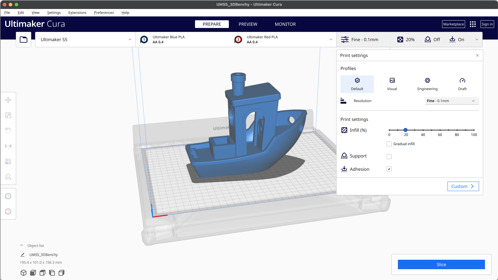

<br>

<div align = center>

[![Badge Issues]][Issues]   
[![Badge PullRequests]][PullRequests]   
[![Badge Closed]][Closed]

[![Badge Size]][#]   
[![Badge License]][License]   
[![Badge Contributors]][Contributors]

[![Badge Test]][Test]   
[![Badge Conan]][Conan]   
![Badge Downloads]
<br>
<br>

![Logo]

# Ultimaker Cura

*State-of-the-art slicer app to prepare* <br>
*your 3D models for your 3D printer.*

*With hundreds of settings & community-managed print profiles,* <br>
*Ultimaker Cura is sure to lead your next project to a success.*

<br>
<br>

[![Button Building]][Building]   
[![Button Plugins]][Plugins]   
[![Button Machines]][Machines]

[![Button Report]][Report]   
[![Button Settings]][Settings]   
[![Button Localize]][Localize]

<br>
<br>

<picture>
  <source media="(prefers-color-scheme: light)" srcset="./cura-logo.PNG">
  <source media="(prefers-color-scheme: dark)" srcset="./cura-logo-dark.PNG">
  
</picture>

</div>

<br>

[](https://api.securityscorecards.dev/projects/github.com/Ultimaker/Cura)

<br>

<!----------------------------------------------------------------------------->

[Contributors]: https://github.com/Ultimaker/Cura/graphs/contributors
[PullRequests]: https://github.com/Ultimaker/Cura/pulls
[Machines]: https://github.com/Ultimaker/Cura/wiki/Adding-new-machine-profiles-to-Cura
[Building]: https://github.com/Ultimaker/Cura/wiki/Running-Cura-from-Source
[Localize]: https://github.com/Ultimaker/Cura/wiki/Translating-Cura
[Settings]: https://github.com/Ultimaker/Cura/wiki/Cura-Settings
[Plugins]: https://github.com/Ultimaker/Cura/wiki/Plugin-Directory
[Closed]: https://github.com/Ultimaker/Cura/issues?q=is%3Aissue+is%3Aclosed
[Issues]: https://github.com/Ultimaker/Cura/issues
[Conan]: https://github.com/Ultimaker/Cura/actions/workflows/conan-package.yml
[Test]: https://github.com/Ultimaker/Cura/actions/workflows/unit-test.yml

[License]: LICENSE
[Report]: docs/Report.md
[Logo]: resources/images/cura-icon.png
[#]: #


<!---------------------------------[ Badges ]---------------------------------->

[Badge Contributors]: https://img.shields.io/github/contributors/ultimaker/cura?style=for-the-badge&logoColor=white&labelColor=db5e8a&color=ab4a6c&logo=GitHub
[Badge PullRequests]: https://img.shields.io/github/issues-pr/ultimaker/cura?style=for-the-badge&logoColor=white&labelColor=bb9f3e&color=937d31&logo=GitExtensions
[Badge License]: https://img.shields.io/badge/License-LGPL3-336887.svg?style=for-the-badge&labelColor=458cb5&logoColor=white&logo=GNU
[Badge Closed]: https://img.shields.io/github/issues-closed/ultimaker/cura?style=for-the-badge&logoColor=white&labelColor=629944&color=446a30&logo=AddThis
[Badge Issues]: https://img.shields.io/github/issues/ultimaker/cura?style=for-the-badge&logoColor=white&labelColor=c34360&color=933349&logo=AdBlock
[Badge Conan]: https://img.shields.io/github/workflow/status/Ultimaker/Cura/conan-package?style=for-the-badge&logoColor=white&labelColor=6185aa&color=4c6987&logo=Conan&label=Conan%20Package
[Badge Test]: https://img.shields.io/github/workflow/status/Ultimaker/Cura/unit-test?style=for-the-badge&logoColor=white&labelColor=4a999d&color=346c6e&logo=Codacy&label=Unit%20Test
[Badge Size]: https://img.shields.io/github/repo-size/ultimaker/cura?style=for-the-badge&logoColor=white&labelColor=715a97&color=584674&logo=GoogleAnalytics
[Badge Downloads]: https://img.shields.io/github/downloads-pre/Ultimaker/Cura/latest/total?style=for-the-badge


<!---------------------------------[ Buttons ]--------------------------------->

[Button Localize]: https://img.shields.io/badge/Help_Localize-e2467d?style=for-the-badge&logoColor=white&logo=GoogleTranslate
[Button Machines]: https://img.shields.io/badge/Adding_Machines-yellow?style=for-the-badge&logoColor=white&logo=CloudFoundry
[Button Settings]: https://img.shields.io/badge/Configuration-00979D?style=for-the-badge&logoColor=white&logo=CodeReview
[Button Building]: https://img.shields.io/badge/Building_Cura-blue?style=for-the-badge&logoColor=white&logo=GitBook
[Button Plugins]: https://img.shields.io/badge/Plugin_Usage-569A31?style=for-the-badge&logoColor=white&logo=ROS
[Button Report]: https://img.shields.io/badge/Report_Issues-C9284D?style=for-the-badge&logoColor=white&logo=Cliqz

# Cura-Slicer-Development
Compiling Cura from Source using documentation 

## Installing Requirements
installing the requriemrts mentioned in https://github.com/Ultimaker/Cura/wiki/Getting-Started

Following programs need to be installed for running from source on Windows:

- Windows 10 or higher
- Visual Studio with MSVC 2022 or higher
- Python 3.10.4 or higher
- venv (Python)
- sip (Python) 6.5.1
- CMake 3.23 or higher
- Ninja 1.10 or higher
- Conan >=1.60.2 <2.0.0


#### IMPORTANT NOTE: Install there using Powershell. Use the native powershell, not x86 version
#### Check https://www.architectryan.com/2018/03/17/add-to-the-path-on-windows-10/ to know how to add programs to PATH


## Installation Steps

### Visual Studio with MSVC 2022 or higher
1. **Download Visual Studio Installer:**
   - Visit the official Visual Studio download page at [https://visualstudio.microsoft.com/downloads/](https://visualstudio.microsoft.com/downloads/)
   - Select your desired edition (Community mostly) and click "Download."

2. **Run the Installer:**
   - Execute the downloaded installer (usually `vs_installer.exe`).

3. **Choose Workloads:**
   - Select the `Desktop development with C++` workload, which includes MSVC and related tools.
   - Optionally, add other workloads or components as needed.

4. **Customize Installation (Optional):**
   - Explore the "Individual components" tab to customize your installation further.

5. **Modify Installation Location (Optional):**
   - Change the installation location if desired.

6. **Start Installation:**
   - Click the "Install" button to begin the installation.

#### Python 3.10.4 or higher
1. **Download Python Installer:**
   - Visit the official Python downloasd page at  [https://www.python.org/downloads/](https://www.python.org/downloads/).
   - Scroll down to find the latest Python 3.10.4 (or higher) release for Windows.
   - Click on the "Download Python 3.10.4" (or the latest version) button to download the installer.

2. **Run the Installer:**
   - Execute the downloaded installer (usually named `python-3.10.4.exe` or similar).
   - Ensure that the option "Add Python x.y to PATH" (where "x.y" represents the Python version) is checked during installation.

3. **Customize Installation (Optional):**
   - Customize the installation by clicking on the "Customize installation" button. You can select additional features or modify the installation directory if needed.

4. **Install Python:**
   - Click the "Install Now" button to start the installation process.
   - Python 3.10.4 (or the latest version) will be installed on your system with the selected options.

5. **Verify Python Installation:**
   - Open a new Windows PowerShell window.
   - To verify that Python is installed and accessible, run the following command:
     ```bash
     python --version
     ```
     You should see the installed Python version displayed in the output.

6. **Python Available in PATH:**
   - Since you selected the option to add Python to the PATH during installation, you can use Python from any Windows PowerShell session without specifying the full path to the Python executable.
 
#### venv (Python)

1. Its already packaged inside Python

#### sip (Python) 6.5.1
1. **Install SIP:**
   - To install SIP, you can use Python's package manager, `pip`. Run the following command to install SIP:
     ```bash
     pip install sip
     ```

#### CMake 3.23 or higher
1. **Open Windows PowerShell:**
   - Open a Windows PowerShell window by searching for "PowerShell" in the Start menu.

2. **Download CMake Installer:**
   - Visit the official CMake download page at [https://cmake.org/download/](https://cmake.org/download/).
   - Scroll down to the "CMake Binary Distribution" section.
   - Download the Windows Installer (64-bit depending on your system).

3. **Run the CMake Installer:**
   - Execute the downloaded CMake installer (usually named `cmake-x.y.z-win64-x64.msi` or similar).
   - Follow the installation wizard's prompts.

4. **Select Installation Options:**
   - During installation, you can choose whether to add CMake to the system PATH for all users or just the current user. Select the option that suits your needs.

5. **Complete Installation:**
   - Continue through the installation wizard, specifying any other installation preferences as needed.
   - Click "Install" to begin the installation process.

6. **Verify CMake Installation:**
   - To verify that CMake is installed, open a new Windows PowerShell window.
   - Run the following command to check the CMake version:
     ```bash
     cmake --version
     ```
     You should see the installed CMake version displayed in the output.

7. **Ensure CMake is in PATH:**
   - To ensure that the CMake executable is in the PATH of Windows PowerShell, you can check the directory where it's installed. The CMake executable is typically located in the `bin` directory within the installation folder.
   - Add this directory to your system's PATH as follows:
     - Open the Start menu and search for "Environment Variables."
     - Click on "Edit the system environment variables." This will open the System Properties window.
     - In the System Properties window, click the "Environment Variables" button.
     - In the "System variables" section, scroll down and find the "Path" variable, then click "Edit."
     - Click "New" and add the path to the `bin` directory of your CMake installation. For example, it might be something like `C:\Program Files\CMake\bin`.
     - Click "OK" to save the changes.

8. **Verify CMake in PATH:**
   - To verify that CMake is now accessible from Windows PowerShell, open a new PowerShell window and run  the following command to check the CMake version:
     ```bash
     cmake --version
     ```
#### Ninja 1.10 or higher

1. **Open Windows PowerShell:**
   - Open a Windows PowerShell window by searching for "PowerShell" in the Start menu.

2. **Download Ninja Binary:**
   - Visit the official Ninja download page at [https://github.com/ninja-build/ninja/releases](https://github.com/ninja-build/ninja/releases).
   - Scroll down to the "Assets" section of the latest release and download the Windows binary executable (`.exe`) for Ninja. It might be zipped, so download and extract it. Ensure you download a version that is 1.10 or higher.

3. **Move Ninja Executable:**
   - After downloading Ninja, move the Ninja executable to a directory where you want to store it. For example, you can place it in a directory like `C:\Tools\ninja-win` or any location of your choice like `C:\Program Files\ninja-win`

4. **Add Ninja Directory to PATH:**
   - To make Ninja available in the PATH of Windows PowerShell, you need to add the directory where you placed the Ninja executable to the system's PATH.
     - Open the Start menu and search for "Environment Variables."
     - Click on "Edit the system environment variables." This will open the System Properties window.
     - In the System Properties window, click the "Environment Variables" button.
     - In the "System variables" section, scroll down and find the "Path" variable, then click "Edit."
     - Click "New" and add the path to the directory where you placed the Ninja executable (e.g., `C:\Tools\ninja-win` or `C:\Program Files\ninja-win`).
     - Click "OK" to save the changes.

5. **Verify Ninja Installation:**
   - To verify that Ninja is now accessible from Windows PowerShell, open a new PowerShell window.
   - Run the following command to check the Ninja version:
     ```bash
     ninja --version
     ```
     You should see the installed Ninja version (1.10 or higher) displayed in the output.

#### Conan >=1.60.2 <2.0.0
1. **Open Windows PowerShell:**
   - Open a Windows PowerShell window by searching for "PowerShell" in the Start menu.

2. **Install Conan via pip:**
   - You can use Python's package manager, `pip`, to install Conan with a specific version range. Run the following command to install Conan >=1.60.2 and <2.0.0:
     ```bash
     pip install "conan>=1.60.2,<2.0.0"
     ```

3. **Verify Conan Installation:**
   - To verify that Conan is installed with the desired version range, you can check the installed version by running the following command:
     ```bash
     conan --version
     ```
     You should see the installed Conan version within the specified range displayed in the output.

4. **Ensure Conan is in PATH:**
   - To ensure that the Conan executable is in the PATH of Windows PowerShell, you need to check the directory where it's installed. The Conan executable is typically located in a directory that corresponds to your Python environment.
     - Open the Start menu and search for "Environment Variables."
     - Click on "Edit the system environment variables." This will open the System Properties window.
     - In the System Properties window, click the "Environment Variables" button.
     - In the "System variables" section, scroll down and find the "Path" variable, then click "Edit."
     - Click "New" and add the path to the directory where Conan is installed. This path may vary depending on your Python environment but is often similar to `C:\Users\<YourUsername>\AppData\Local\Programs\Python\<PythonVersion>\Scripts`, where `<YourUsername>` is your user profile name, and `<PythonVersion>` is your Python version.
     - Click "OK" to save the changes.

5. **Verify Conan in PATH:**
   - To verify that Conan is now accessible from Windows PowerShell, open a new PowerShell window.
   - Run the following command to ensure that Conan is recognized and working correctly:
     ```bash
     conan --version
     ```


## Installation
- After cloning Cura in step 2. of the Cura Documentation, Clone Fraktory/Cura Installation
- Follow step 3 onwards at https://github.com/Ultimaker/Cura/wiki/Running-Cura-from-Source

